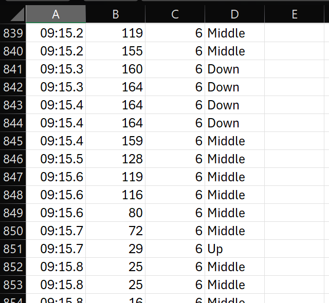

# Integrated Computer Vision System (Microsoft Data Science Application)

## 📌 Project Overview
A modular Computer Vision system designed to explore Human-Computer Interaction (HCI) and Bio-mechanics Data Acquisition. [cite_start]Developed as part of an advanced CV research initiative[cite: 26].

## 🛠 Modules
1.  **AI Virtual Mouse:** Non-intrusive cursor control using landmark tracking and jitter smoothing.
2.  **Generative Air Canvas:** Virtual painting interface using finger-tip detection.
3.  **AI Personal Trainer (Data Science Integrated):** - Real-time pose estimation for exercise form correction.
    - **Automated Data Engineering:** Logs joint angles, timestamps, and repetition stages to `workout_data.csv` for time-series analysis.

## 💻 Tech Stack
-   **Core:** Python 3.10, OpenCV, MediaPipe
-   **Data:** CSV, NumPy
-   **Hardware:** Standard Webcam (CPU-optimized inference)

## 🚀 How to Run
1.  Install dependencies:
    ```bash
    pip install -r requirements.txt
    ```
2.  Launch the main dashboard:
    ```bash
    python main.py
    ```
3.  Select Mode:
    - `1`: Mouse Control
    - `2`: Virtual Painter
    - `3`: AI Trainer (Logs data automatically)

## 📊 Data Acquisition

The system automatically engineers a dataset (`workout_data.csv`) during training sessions, enabling further analysis of user fatigue patterns and repetition consistency.

## 📸 System Screenshots
| Main Menu | AI Trainer | Virtual Painter |
|:---:|:---:|:---:|
|  |  |  |

**Data Verification:**

